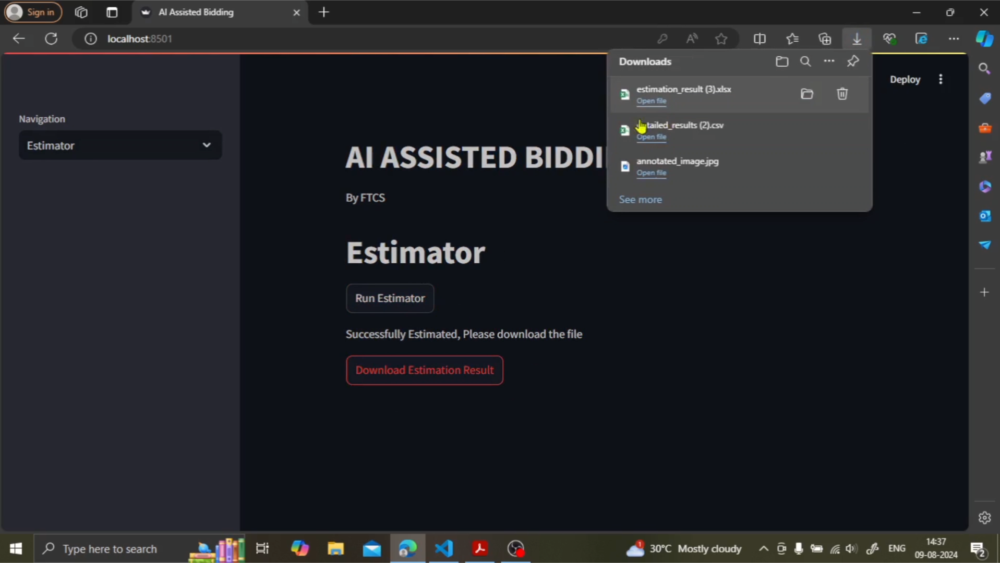

# **AI ASSISTED BIDDING - TEST APP**
---

# ***Problem Statement***
Detecting small symbols in digital architectural floor plans is challenging due to occlusion, clutter, and varying graphical styles, making traditional methods inadequate for accurately identifying structural components, utilities, and furnishings in complex layouts.

- *Importance of Small Object Detection:* Critical in industries like defense, healthcare, and manufacturing for detecting objects in large, cluttered images.
- *Challenges in Architectural Plans:* Small symbols are difficult to detect due to overlapping elements, clutter, and varying styles, making manual analysis impractical.
- *Limitations of Traditional Methods:* Existing methods struggle with occlusion, graphical variability, and complexity in real-world data.
- *Solution Developed:* Leveraged deep learning, inspired by YOLOv8, with a tile-based training strategy to improve small object detection in architectural plans and other applications.

Check **[Detailed Report](Detailed%20Report.pdf)** for complete details about Data pre-processing, Model, Training strategies, and Inference.

---
# ***Demo***

<div align="center">
  <!-- First row -->
  
  
</div>

<div align="center">
  <!-- First row -->
  
  
</div>

<div align="center">
  <!-- First row -->
  
  
</div>

<div align="center">
  <!-- First row -->
  
  
</div>

---
# ***Prediction Pipeline***


This project implements an object detection pipeline using `YOLOv8` architecture with `Effientnetb6` backbone.

## **Setup**

1. Clone the repository:
  ```
  git clone https://github.com/RamakrishnaReddyPalle/AAB-test-app.git
  ```
2. Change directory to git clone:
```
cd "path\to\AAB-test-app"
```
3. Install the dependencies: (version specific given)
  ```
  pip install -r requirements.txt
  ```

## **Configuration**

4. The `params.yaml` file contains S3 buscket keys for:<br >
   a) Model key <br >
   b) Input/uploaded image key<br >
   c) Output/downloadable image key<br >
   d) Output `.csv` details key<br >

   * These can be only accessed through Access ID and secret key for the bucket
   * If you want to run the pipeline locally, params.yaml has #commented code which are the params for local, and the app.py abd prediction_pipeline.py has to be modified accordingly.

## **Running the Pipeline locally:**

5. To run the prediction pipeline, execute:
```
python src/pipeline/prediction_pipeline.py
```
